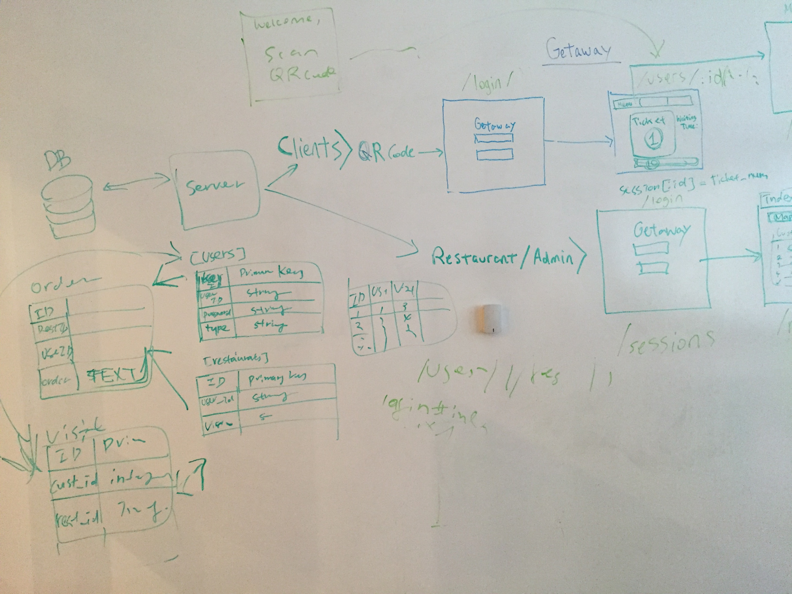

# Project streamLine

## Introduction:

 //  Simple application to help restaurant customers to avoid waiting in queue, especially when its busy and return back to restaurant whenever the table is ready.//

## Users can:
 1. The app has two separate users (clients) restaurant and customers.
    2. The Customer can login, reserve a spot in the restaurant and Not wait in the queue outside the restaurant.
    3. Make orders while they are away waiting for their table, or cancel their reservation.
    4. The restaurant owner can login in check the list of reservations.
    5. Check the orders made my customers.
    6. Map the location of their customers.
    7. Send a message to the customers when the table is ready.

## Front End Wire Frame:

## DataBase Design:

## Pseudo Code:
### As a Customer:
1. Scan the Q.R Code, And is directed to the login page.
2. The customer logs in as a new user or a returning customer.
3. As soon as customer logs in they are directed to a ticket page.
4. Receives a ticket number.
5. The ticket number page has a order button, which shows the menu page and customers can place their order.
6. Customer receives an alert when table is ready.

### As a Restaurant Owner:
1. Log in and view the list of reservations.
2. Click on the customers to views customer order.
3. Send alert to customer.

## WebSocket Server:

WebSocket server was created to relay messages between restaurants and their customers.

## Group Members:

#### Sharon
#### Danny
#### Felix
#### Paresh
